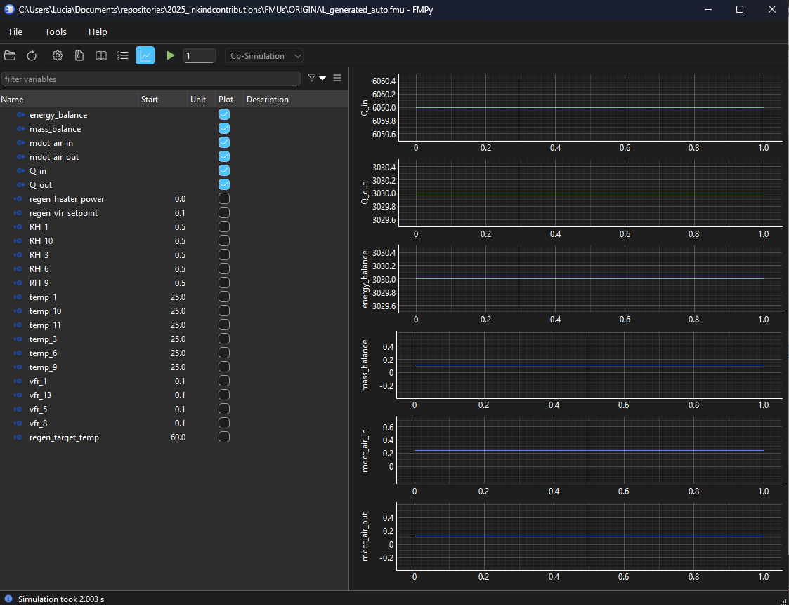

# UniFMU Setup and FMU Generation on Windows (Python 3.12)

This guide explains how to install UniFMU in your standalone Python 3.12 environment and use it to generate an FMU from a Python model.

---

## ✅ Requirements

- Create a virtual environment and activate the environment
  ```
  python -m venv venv
  .\venv\Scripts\activate
  ```
- Install requirements .txt:
  ```
  pip install -r requirements.txt
  ```
---

## 📦 Step 1: Install dependencies of `unifmu` and the rest of packages from `requirements.txt`

To install **UniFMU** and all required dependencies in a Python 3.12 environment, you can use the provided `requirements.txt` file located in the project’s root directory.

This ensures all packages are installed consistently, including compatibility fixes such as the correct `protobuf` version required by UniFMU.

### ▶️ Instructions:

1. **Activate your Python 3.12 environment**, if not already active.

2. **Run the following commands in your terminal:**

```bash
pip install --upgrade pip
pip install -r requirements.txt
```

The last version can be found in https://github.com/INTO-CPS-Association/unifmu/releases/tag/0.0.11 and it is not available in pip, so download the binaries and replace in the Scripts folder. Make sure that everything is installed:

```
pip install unifmu[python-backend]
```
---

## 🔍 Step 2: Verify the Installation

To confirm that UniFMU is installed:

```bash
pip show unifmu
```

You should see output showing the package name, version, and install location.

---

## ⚙️ Step 3: Generate the FMU

Once installed, you can generate your FMU using the UniFMU CLI:

```bash
".\venv\Scripts\unifmu.exe" generate python ORIGINAL.fmu
```

- `ORIGINAL.fmu` is the name of the FMU that will be created.
- This assumes you have a valid Python class that inherits from `PythonModel` in your script (e.g. `model.py`).

---

## ✅ Optional: Add to PATH

To use `unifmu` globally without the full path, add this folder to your system `PATH`:

```
C:\Users\<YourUsername>\Documents\repositories\2025_Inkindcontributions\venv\Scripts
```

---

## 📁 Project Example Structure

```
python_adder_model_eium.fmu/
├── binaries/
│   ├── darwin64/
│   │   └── unifmu.dylib         # macOS shared library (placeholder or real binary)
│   ├── linux64/
│   │   └── unifmu.so            # Linux shared object (placeholder or real binary)
│   └── win64/
│       └── unifmu.dll           # Windows DLL (placeholder or real binary)
├── resources/
│   ├── schemas/
│   │   ├── unifmu_fmi2_pb2.py
│   │   └── unifmu_fmi2_pb2_grpc.py
│   ├── backend_grpc.py
│   ├── backend_schemaless_rpc.py
│   ├── fmi2.py
│   ├── launch.toml             # Updated to point to Python 3.12 interpreter
│   └── model.py                # Your Python FMU model logic
├── modelDescription.xml        # Describes inputs, outputs, and structure
└── README.md                   # Documentation (optional)
```

- The `binaries/` directory contains native shared libraries for different operating systems (required even if empty or mocked).
- The `resources/` directory contains the actual Python backend and model implementation.
- `modelDescription.xml` must be at the root of the FMU.
- `launch.toml` controls how the backend is started based on OS.

---

## 🧩 FMU Configuration: `launch.toml` Setup for Python 3.12

To ensure that UniFMU uses the correct Python interpreter when launching the FMU backend on Windows, update your `resources/launch.toml` file as follows if using `zmq` or `gprc`. It will be updated automatically with the `update_and_package_fmu.py`:

```toml

backend = "grpc"

[grpc]
linux = ["python3", "backend_grpc.py"]
macos = ["python3", "backend_grpc.py"]
windows = ["./venv/Scripts/python.exe", "backend_grpc.py"]

[zmq]
linux = ["python3", "backend_schemaless_rpc.py"]
macos = ["python3", "backend_schemaless_rpc.py"]
serialization_format = "Pickle"
windows = ["./venv/Scripts/python.exe", "backend_schemaless_rpc.py"]

```

This guarantees that your FMU will run using the correct interpreter and avoid errors with missing modules or backend startup. In this case we are using backend "grpc", but we add the correct adress in both sections

---

## 🆘 Troubleshooting

- If `unifmu` is not recognized, always use the full path.
- Use `--help` to see available commands:
  ```bash
  "./venv/Scripts/unifmu.exe" --help
  ```
- Add path to the environmental variables in which `unifmu.exe` is installed in order to be able to execute the tool:
  ```bash
  ./venv/Scripts
  ```

---

## 🔄 Step 4: Update and Package FMU from Source Code

Once you have the FMU template structure generated (including `model.py`, `modelDescription.xml` and `launch.toml` and folder layout inside `FMUs/ORIGINAL.fmu`), you can regenerate and update the contents using the script `update_and_package_fmu.py`.

### 📌 Purpose:
This script:
- Creates a copy of `ORIGINAL.fmu` (obtained directly from UNIFMU) and gives the name of `ORIGINAL_modified.fmu`
- Regenerates the logic in `model.py` and `modelDescription.xml` using the function defined in `fmu_psycrometry.py`.
- Update `launch.toml` according to the instalation of the python environment.
- Use the input names and the initial values of the script `fmu_psycrometry.py`.
- Saves these files into the `resources/` subfolder of the FMU template.
- Compresses the FMU folder and renames it as a `.fmu` file (instead of `.zip`) and update the name to `ORIGINAL_modified_auto.fmu`.

### ▶️ To run it:

```bash
python update_and_package_fmu.py
```

### 📁 Result:

You will get an updated FMU file (zipped and without zipped) in `FMUs/ORIGINAL_modified_auto.fmu`. This can now be used for testing or simulation with fmpy library.


## ▶️ Step 5: Execute the FMU with FMPy

To run your generated FMU in a graphical environment using [FMPy GUI](https://github.com/CATIA-Systems/FMPy) or you can run in a separate script.

---

### ▶️ Option 1: Launch FMUGUI

To launch the graphical interface:

```bash
"./venv/Scripts/python.exe" -m fmpy.gui
```

A window like the one below will open.

---

### 📂 Load and Run the FMU with gui

1. Click **File > Open** and select your `.fmu` file (e.g., `ORIGINAL_generated_auto_zipped.fmu`).
2. Use the **Start** column to initialize inputs.
3. Press the **Play** ▶️ button to simulate.
4. Check the **Plot** boxes for outputs you'd like to visualize.

---

### 📊 Example Output

Below is an example plot obtained by loading the FMU and simulating it over 5 seconds:



---

### ▶️ Option 2: Execute simulate_fmu.py

This script takes the fmu `ORIGINAL_generated_auto_zipped.fmu` located in FMUs folder and uses fmpy package to get the results. They are obtained in a scsv file(`simulation_inputs_outputs.csv`) file and a pdf(`simulation_plots.pdf`):

Some of the results are shown in the following images:


---


## 🔗 References

- 🔧 Official UniFMU repository and installation instructions:  
  https://github.com/INTO-CPS-Association/unifmu/tree/master?tab=readme-ov-file#getting-the-tool

- 🖥 How to use the CLI:  
  https://github.com/INTO-CPS-Association/unifmu/tree/master?tab=readme-ov-file#how-can-i-execute-the-launch-command-through-a-shell

- 📄 Reference article:  
  Legaard, C. M., Tola, D., Schranz, T., Macedo, H. D., & Larsen, P. G. (2021).  
  *A Universal Mechanism for Implementing Functional Mock-up Units*.  
  In G. Wagner et al. (Eds.), Proceedings of the 11th International Conference on Simulation and Modeling Methodologies, Technologies and Applications, SIMULTECH 2021, pp. 121–129. SCITEPRESS.  
  https://doi.org/10.5220/0010577601210129


---

## 👩‍💻 Author

**EIUM – FMU development using UniFMU from python script (psycrometry application)**  
Developed by *Lucia Royo-Pascual, Ph.D.*  
