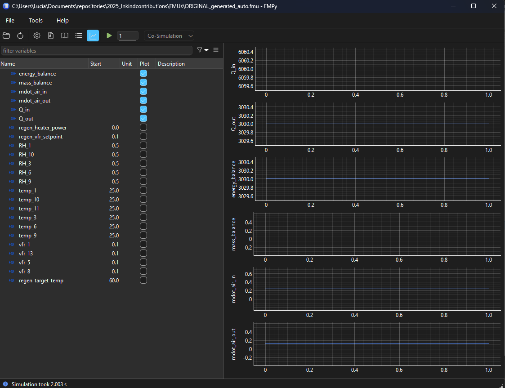

# Packaging and runtime

- [CLI](#cli)
- [What `fmugen build` does](#what-fmugen-build-does)
- [Generated FMU layout](#generated-fmu-layout)
- [Requirements and `--vendor`](#requirements-and---vendor)
- [Runtime Python](#runtime-python)
- [Simulating](#simulating)
- [Project layout](#project-layout)
- [Updating the UniFMU boilerplate](#updating-the-unifmu-boilerplate)

---

## CLI

`uv sync` installs this project in editable mode, so the `fmugen` command always runs the code in `src/fmugen/` and finds the UniFMU boilerplate in `src/fmu/fmi2/` and `src/fmu/fmi3/`.

### `fmugen init`

```
uv run fmugen init MODEL [-o OUTPUT] [--call METHOD] [--fmi {2,3}] [--force]
```

| Argument | Description |
|---|---|
| `MODEL` | `model.py`, `model.py:Name`, or `package.module:Name` (an installed module). |
| `-o, --output` | Where to write the config. Default: `fmugen.toml` next to the model (or in the current directory for an installed module). `-` prints it instead. The model file must be inside the config's folder. |
| `--call` | For classes: the method run on each step, when it isn't `step`/`do_step`/`update`/`__call__`/the only public method. |
| `--fmi {2,3}` | Write `fmi_version` into the config. With `3`, also infer arrays and Binary. |
| `--force` | Overwrite an existing config. |

What it infers: [models.md](models.md#what-fmugen-init-infers).

### `fmugen build`

```
uv run fmugen build MODEL -o OUTPUT [options]
```

| Argument | Description |
|---|---|
| `MODEL` | A `fmugen.toml`, a directory containing one, or a model (`model.py[:Name]`, `package.module:Name`) whose config is inferred in memory. |
| `-o, --output` | Output path, used exactly as given. |
| `--fmi {2,3}` | FMI version to build. Default: `[model] fmi_version`, else 2. |
| `--format {fmu,folder}` | `fmu` (default): zipped `.fmu` archive. `folder`: unzipped UniFMU folder. |
| `--python [PATH]` | Python executable written into `launch.toml` for Windows. The flag alone uses the current interpreter. If omitted, the boilerplate's `python` is kept. |
| `--vendor` | Install `[model] requirements` into the FMU (`resources/site`). |
| `--name` | `modelName` in `modelDescription.xml`; overrides `[model] name`. |
| `--author` | `author` in `modelDescription.xml`; overrides `[model] author`. |
| `--call` | Like `init --call`, when `MODEL` is a `.py` file with a class. |

---

## What `fmugen build` does

1. Reads and validates `fmugen.toml`, or infers it from a `.py` model.
2. Copies the UniFMU boilerplate for the FMI version (`src/fmu/fmi2/` or `src/fmu/fmi3/`). Replaces `resources/model.py` with fmugen's adapter for that version (`src/fmugen/templates/model_fmi2.py` or `model_fmi3.py`), and adds the shared engine `resources/fmugen_runtime.py`.
3. Copies the entry file and `sources` into `resources/fmugen_model/`, keeping their paths. Appends `requirements` to `resources/requirements.txt`, and installs them into `resources/site/` with `--vendor`.
4. Imports the entry from the copied files, checks the config against it (argument names, function vs class), and writes `resources/interface.json`.
5. **Probe:** runs the packaged model once through the real adapter: setup, initialization, one tick of every input clock (FMI 3), one `doStep`, then save and restore state. A model that fails here fails the build, with the model's error message. Whether the state could be saved decides `canGetAndSetFMUstate`.
6. Writes `modelDescription.xml` and, with `--python`, `launch.toml`, then zips the result (or copies the folder).

The probe runs the model in the build's Python. A model with requirements must therefore be importable there, either installed in the build environment or with `--vendor`.

---

## Generated FMU layout

```
model.fmu
├── binaries/                            # UniFMU native libraries (from src/fmu/fmi2 or fmi3)
├── modelDescription.xml                 # generated from fmugen.toml
└── resources/
    ├── main.py, backend.py, ...         # UniFMU Python backend (from src/fmu/fmi2 or fmi3)
    ├── schemas/                         # UniFMU protobuf messages
    ├── launch.toml                      # how UniFMU starts the backend per OS
    ├── requirements.txt                 # backend requirements + [model] requirements
    ├── model.py                         # fmugen's FMI 2 or FMI 3 adapter
    ├── fmugen_runtime.py                # fmugen's engine, shared by both adapters
    ├── interface.json                   # variables, value references, bindings
    ├── fmugen_model/                    # your files, unchanged
    │   └── ...
    └── site/                            # only with --vendor
```

Your code is never rewritten.

`interface.json` is fmugen's normalised description of the model: the FMI version, the entry, `sys.path`, constants, time arguments, the experiment, type definitions, every variable with its binding, and the clocks and events. The engine reads it at runtime, and `modelDescription.xml` is generated from it.

---

## Requirements and `--vendor`

`[model] requirements` lists what your model needs from PyPI (pip requirement specifiers):

```toml
[model]
entry = "simple_pid:PID"
requirements = ["simple-pid==2.0.1"]
```

| | Without `--vendor` | With `--vendor` |
|---|---|---|
| **Where the packages are** | `resources/requirements.txt` lists them; the runtime Python must already have them | installed into `resources/site/`, which the adapter puts on `sys.path` first |
| **Build machine** | must have them installed too (for the probe) | needs network or a uv/pip cache |
| **Portability** | depends on the target Python | self-contained for pure-Python packages |

`--vendor` uses `uv pip install --target` when `uv` is on `PATH`, otherwise `python -m pip install --target`. Packages with compiled extensions are installed for the build machine's platform and Python version. For other platforms, install them in the target Python instead.

UniFMU's own backend requirements (`protobuf==5.27.3`, `pyzmq`) are never vendored. The runtime Python must have them (see below).

---

## Runtime Python

UniFMU starts the backend with the command in `resources/launch.toml`:

```toml
linux = ["python3", "main.py"]
macos = ["python3", "main.py"]
windows = ["python", "main.py"]
```

That Python needs:

- `protobuf==5.27.3`, `pyzmq` (the UniFMU backend)
- your model's requirements, unless they are vendored

Options:

- `--python` writes the current interpreter (e.g. this project's `.venv`) into `launch.toml` for Windows. Simplest for local use, but the FMU then only works on that machine.
- Without it, the FMU uses `python` / `python3` from `PATH`, which must have the packages above.

---

## Simulating

```bash
uv run fmpy simulate out/psychrometry.fmu --stop-time 10 --start-values temp_1 30 --output-file out/results.csv
```

FMPy simulates FMI 2 and FMI 3 FMUs the same way. In Python, `fmpy.simulate_fmu(..., event_mode_used=True)` also handles output clocks (`eventHandlingNeeded`) and `[events] terminate`. FMPy never ticks *input* clocks, though. FMUs whose code runs on input clocks need an importer that ticks them, or a script using `fmpy.fmi3.FMU3Slave` (see `tests/test_fmi3.py`).

Time-varying inputs come from a CSV whose first column is time. Here they come from the RC building example's weather file (build the FMU first, as in [examples/rc_building](../examples/rc_building/README.md)):

```bash
uv run fmpy simulate out/rc_building.fmu --input-file examples/rc_building/weather.csv --output-interval 3600 --output-file out/rc_building.csv
```

Without `--output-file`, FMPy plots the result instead, which requires matplotlib (`uv run --with matplotlib ...`).

```bash
uv run python -m fmpy.gui
```

In the GUI, open the `.fmu`, set start values, press play, and tick outputs to plot.



---

## Project layout

| Path | Contents |
|---|---|
| `src/fmugen/config.py` | `fmugen.toml` loading, validation, normalisation into the interface spec (FMI 2 and 3) |
| `src/fmugen/interface.py` | `fmugen init`: inference and TOML output |
| `src/fmugen/description.py` | `modelDescription.xml` writers (FMI 2 and FMI 3) |
| `src/fmugen/templates/fmugen_runtime.py` | The engine copied into every FMU: runs the user's code, values, clocks, state |
| `src/fmugen/templates/model_fmi2.py`, `model_fmi3.py` | The adapters copied into the FMU as `resources/model.py`: FMI calls → engine |
| `src/fmugen/__main__.py` | CLI, packaging, vendoring, build probe |
| `src/fmu/fmi2/`, `src/fmu/fmi3/` | UniFMU Python boilerplate the FMU is built from, per FMI version |
| `examples/` | Example models with their `fmugen.toml` |
| `tests/` | `uv run pytest` |
| `tools/unifmu.exe` | UniFMU 0.14 CLI, used to regenerate `src/fmu/` |
| `docker/` | FMU + OPC UA + Streamlit demo stack (see [docker/Readme.md](../docker/Readme.md)) |

---

## Updating the UniFMU boilerplate

`src/fmu/fmi2/` and `src/fmu/fmi3/` were created with the UniFMU CLI. To refresh them with a newer UniFMU version, delete the folder and regenerate it:

```bash
./tools/unifmu.exe generate python src/fmu/fmi2 fmi2
```

```bash
./tools/unifmu.exe generate python src/fmu/fmi3 fmi3
```

UniFMU 0.14 writes `fmiVersion="3.0-beta.4"` into the FMI 3 template's `modelDescription.xml`. That file is replaced on every build, so it doesn't matter.

`fmugen` replaces `resources/model.py` and `modelDescription.xml`, adds `fmugen_runtime.py`, `interface.json`, `fmugen_model/` and `site/`, appends to `requirements.txt` and (with `--python`) rewrites `launch.toml`. The backend and binaries are taken as-is. After updating, run `uv run pytest`, and check the backend's command list in `resources/backend.py` against [fmi.md](fmi.md).
